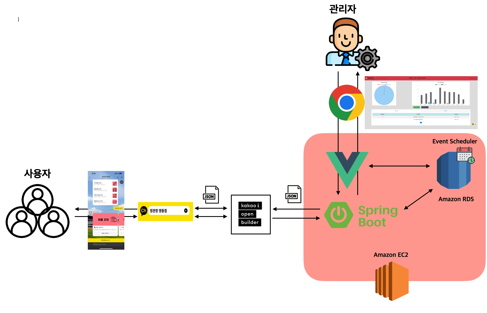

# 카카오 채널 정관장 영동점 챗봇 서비스

[카카오 채널 연결](http://pf.kakao.com/_xnTuxaxj/friend)

[챗봇 이용해보기](http://pf.kakao.com/_xnTuxaxj/chat)

## 개발 동기 🧐

---

> [제품 카탈로그](https://kgc.makevu.me/25NewYear_standard#page=7)를 모바일 환경에서 확인하는 것에 어려움이 있다는 다수 고객의 피드백

- 카테코리 이외의 조건(가격대,연령대 등)으로 제품을 확인할 수 없음
- 다수 페이지로 구성되어 있어 원하는 제품을 빠르게 찾기 어려움
- 글자크기가 작아 줌 인/아웃의 번거로움이 발생함

> 삼성 청년 SW아카데미에서 학습한 내용을 토대로 새로운 도메인에 적용

- 주제와 요구사항을 직접 정의하고 설계,구현,유지보수를 경험
- 24시간 가동되는 AWS 서버 구축 및 운영 경험

## 주요 기능 🪄

---

> ## 🙋‍♂️ End-User([챗봇 살펴보기](http://pf.kakao.com/_xnTuxaxj/chat))

    1. 제품 조회
    - 카테고리별 🗂️
    - 금액대별 💰
    - 연령대별 👨‍👩‍👧‍👦
    - 제품명칭  🔎
    - 행사제품 🎁

    2. 게시글 조회
    - 공지사항 📣
    - 행사안내 🌟

    3. 상점 정보 조회 📌
    - 위치정보,연락처

> ## 🧑‍💻 Admin([웹 살펴보기](https://jungkwanjang.store/))

    1. 제품 등록,수정,삭제
    - 행사제품의 경우 행사 기간, 할인 비율, 할인액 설정 가능
    2. 게시글 등록,수정,삭제
    - 행사글의 경우 기간 설정 가능
    3. 상점 정보 수정
    - 연락처,위치정보 설정 가능

## 시연 🎬

---

> # 제품 조회

---

> # 게시글, 상점 정보 확인

## 개발 구조 ⚙️

---

## 개발 이력 🗓️

---

> ### 2022년 12월

    1. 요구사항 정의
    2. DB 설계
    3. Skill Server 구축(SpringBoot)
    4. Admin FrontEnd 구축(Vue)
    5. AWS EC2,RDS 구축 및 도메인 연결

> ### 2023년 1월

    - 23.01.10 v1.0 서비스 오픈
    - 23.01.19 v1.1 제품 조회시 Pagination 구현 (제품 개수에 따른 Timeout 현상 해결)
    - 23.01.26 v1.2 개인화 서비스 구축을 위한 logging 구현 (최근에 찾아본 제품, 조회가 많은 제품 등)
    - 23.01.27 v1.3 카카오 프로필 플러그인 연결 (사용자 동의를 통한 최소 개인정보 수집, 현재 미사용)
    - 23.01.28 v1.4 제품 이미지 기본 값 설정
    - 23.01.31 v1.5 DB 이벤트 스케줄러 구현(00시 기준 행사기간 여부 판단 후 제품 정보 수정)

> ### 2023년 2월

    - 23.02.06 v2.0 일부 코드 서비스 로직 분리(개인화 서비스 관련)
    - 23.02.08 v2.1 Swagger UI Method 제한
    - 23.02.09 v2.2 Admin Page 차트 관련 오류 수정
    - 23.02.10 v2.3 사용자의 채널 추가/차단시 SMS 알림 구현
    - 23.02.11 v2.4 일부 브라우저에서 regex 오류로 인한 페이지 접근 불가 현상 수정

> ### 2023년 4월

    - 23.04.20 v2.5 행사 제품 조회 시 할인 종류별 조회 기능 추가

> ### 2023년 6월

    - 23.06.22 v2.6 제품명 조회시 연관 검색어 매칭이 되지 않던 현산 수정

> ### 2024년 1월

    - 24.01.08 v3.0 채널 포스트 리다이렉션 기능 신설(모바일에서 링크 클릭시 브라우저가 아닌 카카오톡 오픈 유도) 및 카카오채널 가이드 준수에 따른 코드 수정(최대 카드 수, 최대 용량 설정 등)

> ### 2024년 2월
    - 24.02.08 v3.1 서버 도메인 이전
